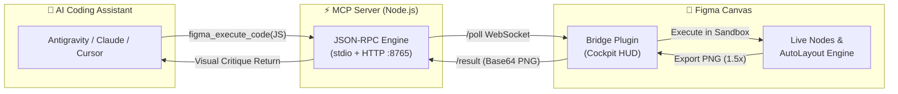

# ⚡ Figma MCP Bridge + Visual Feedback Loop

[](LICENSE)
[](https://modelcontextprotocol.io/)
[](https://nodejs.org)
[](https://python.org)
[](https://figma.com)

> A bidirectional real-time bridge connecting AI coding assistants (**Google Antigravity**, **Claude Desktop**, **Cursor**, **Windsurf**) directly to a live **Figma canvas**, powered by a **Multimodal Visual Feedback Loop** for autonomous UI generation, design system maintenance, and layout iteration.

---

## 🌟 Key Features



- **🎨 Live Canvas Scripting:** Direct JavaScript execution inside the Figma desktop sandbox. Create and manipulate frames, AutoLayout hierarchies, vectors, component sets, and Figma Variables.
- **📸 Multimodal Visual Feedback Loop:** AI models execute code with `capture: true` to receive high-res PNG viewport captures directly back into their context window for visual self-critique.
- **💎 Figma Variables Native:** 100% token binding support (`setBoundVariableForPaint`, `setBoundVariable`) for dark/light themes, typography, radii, and spacing scales.
- **⚡ Zero External Dependencies:** Built with pure Node.js stdio JSON-RPC 2.0 and native browser APIs. Works on Windows, macOS, and Linux out of the box without `npm install`.
- **🛠 Comprehensive Tool Suite:** Dual-mode architecture supporting both local live canvas scripting and Figma Cloud REST API queries.

---

## 🚀 Quickstart (1 Minute)

### 1. Clone & Install

```bash
git clone https://github.com/kolganovr/figma-mcp-bridge.git
cd figma-mcp-bridge
python install.py
```

*Optional: Configure your Figma Personal Access Token during install:*
```bash
python install.py --token "your_figma_personal_access_token"
```

### 2. Import Plugin into Figma Desktop
1. Open **Figma Desktop**.
2. Navigate to **Menu (F)** ➔ **Plugins** ➔ **Development** ➔ **Import plugin from manifest...**.
3. Select `manifest.json` from `figma-plugin/manifest.json` (or `~/.gemini/antigravity/mcp/figma-plugin/manifest.json`).
4. Press **`Ctrl + Alt + P`** (macOS: `Cmd + Option + P`) to launch **Antigravity Bridge**.

### 3. Restart Your AI IDE
Restart your IDE (**Antigravity**, **Claude Desktop**, or **Cursor**) to discover the new MCP tools.

---

## 🛠 Available MCP Tools

### 1. Live Canvas Tools (Local Real-Time Engine)

| Tool | Parameters | Description |
| :--- | :--- | :--- |
| `figma_find_components` | `query` *(string)*<br>`page_name` *(string)*<br>`include_variants` *(bool)*<br>`limit` *(number)* | Fast token-efficient catalog search for master components, variant matrices, and component properties in the active document. |
| `figma_insert_component_instance` | `component_name` *(string)*<br>`component_id` *(string)*<br>`properties` *(object)*<br>`text_overrides` *(object)*<br>`target_parent_id` *(string)*<br>`capture` *(bool)* | Instantiates a master component or variant, safely overrides text/fonts, places into AutoLayout parent, and returns a PNG screenshot. |
| `figma_get_variables` | `collection_name` *(string)* | Retrieves all design tokens, Figma Variable collections, modes (e.g. Light/Dark), and values. |
| `figma_set_variables_mode` | `collection_name` *(string)*<br>`mode_name` *(string)*<br>`target_id` *(string)*<br>`capture` *(bool)* | Switches the active theme mode (e.g. "Dark", "Light") for a target frame, selection, or entire page. |
| `figma_execute_code` | `code` *(string, required)*<br>`description` *(string)*<br>`capture` *(bool, default false)*<br>`scale` *(number, default 1.5)* | Executes live JavaScript in Figma sandbox. When `capture: true`, returns an uncompressed Base64 PNG screenshot directly to the model. |
| `figma_screenshot` | `node_ids` *(array)*<br>`scale` *(number)*<br>`description` *(string)* | Captures selected nodes or entire viewport as PNG. |
| `figma_get_selection` | *None* | Retrieves geometry, bounding box, fill/stroke properties, and hierarchy of currently selected nodes. |
| `figma_create_ui_card` | `title`, `subtitle`, `badge_text`, `button_text`, `bg_color`, `width` | High-level macro generator for AutoLayout cards with instant visual inspection. |

### 2. Cloud REST API Tools (Figma Cloud)

| Tool | Description |
| :--- | :--- |
| `get_file` | Retrieve full document tree and metadata from Figma Cloud. |
| `get_node` | Fetch specific node trees by Node ID. |
| `get_image` | Render remote images or frames via Figma Cloud. |
| `get_styles` | Inspect global published styles and color tokens. |
| `get_components` | Discover published team components and variants. |
| `get_comments` / `post_comment` | Read and post comments directly on design files. |

---

## 🔄 Updating the Bridge

To pull the latest updates and refresh your installed plugin and server:

```bash
git pull origin main
python install.py --update
```

---

## 🩺 System Diagnostics

To check your environment, Node.js runtime, port availability, and MCP config paths:

```bash
python install.py --doctor
```

---

## 📁 Repository Structure

```
figma-mcp-bridge/
├── figma/                      # MCP Server (Node.js stdio engine)
│   ├── index.js                # Server core + HTTP bridge (:8765)
│   ├── instructions.md         # AI Agent guidelines & design rules
│   ├── figma_execute_code.json # Live JS execution schema
│   ├── figma_screenshot.json   # Viewport screenshot schema
│   └── ... (Cloud REST schemas)
├── figma-plugin/               # Figma Desktop Extension
│   ├── manifest.json           # Figma plugin manifest
│   ├── code.js                 # Sandbox execution runtime + Base64 PNG encoder
│   └── ui.html                 # Dark HUD Cockpit UI + live event stream
├── install.py                  # Cross-platform installer, updater & doctor
├── LICENSE                     # MIT License
├── AGENTS.md                   # AI Agent onboarding instructions
└── README.md                   # Documentation & guide
```

---

## 📄 License

This project is licensed under the [MIT License](LICENSE).  
Developed by **Roman Kolganov** (2026).
