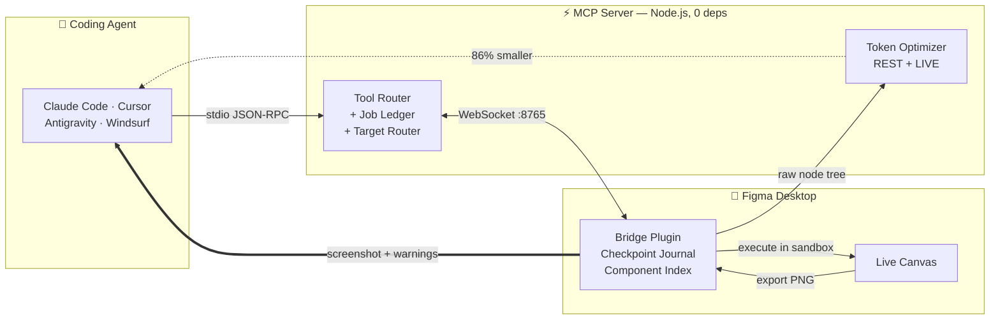

<div align="center">

# ⚡ Figma MCP Bridge

**Let an AI agent design in Figma — and actually see what it drew.**

A zero-dependency MCP server that gives coding agents read *and write* access to a live Figma
canvas, then closes the loop by handing the rendered PNG back to the model for visual self-critique.

[](LICENSE)
[](https://modelcontextprotocol.io/)
[](https://nodejs.org)
[](#engineering-notes)
[](#tool-reference)
[](#how-its-different)

</div>

---

<!-- ─────────────────────────────────────────────────────────────
     DEMO — replace with a real capture before publishing.
     A 15–25s GIF of: prompt → canvas fills in → agent spots its own
     mistake in the returned screenshot → fixes it. This is the single
     highest-impact thing on the page; it proves the loop in one glance.
     Record at 1280×720, keep under ~8 MB so GitHub inlines it.
     ───────────────────────────────────────────────────────────── -->

> **[ demo GIF goes here ]** — agent generates a checkout screen, reads back its own
> screenshot, notices the total is clipped, and fixes the padding. No human in the loop.

---

## The problem

Coding agents are effectively blind inside Figma. Most Figma MCP servers are **read-only** —
they flatten a design into text so a model can turn it into code, and the traffic stops there.
The ones that *can* write are either gated behind a paid Figma seat with a monthly tool-call
quota, or expose a fixed vocabulary of commands (`create_rectangle`, `set_fill`) that runs out
the moment the task gets specific.

And none of them answer the question that actually matters after a write: **did it look right?**
An agent that draws a card, gets back `{"ok": true}`, and moves on has no way to notice that its
text overflowed, its contrast failed, or its frame landed on top of someone else's work.

This bridge closes that loop, and adds the safety rails an autonomous agent needs to be trusted
with a real design file.

---

## How it's different

| | **This bridge** | [Figma Dev Mode MCP](https://help.figma.com/hc/en-us/articles/32132100833559-Guide-to-the-Figma-MCP-server) (official) | [Framelink](https://github.com/GLips/Figma-Context-MCP) | [Talk to Figma](https://github.com/sonnylazuardi/cursor-talk-to-figma-mcp) |
|---|:---:|:---:|:---:|:---:|
| **Writes to the canvas** | ✅ arbitrary JS in the sandbox | ✅ code-to-canvas | ❌ read-only | ✅ fixed command set |
| **Visual feedback loop** | ✅ auto-framed PNG on every write | ⚠️ separate screenshot call | ❌ | ❌ |
| **Undo the agent's work** | ✅ `figma_rollback` | ❌ | n/a | ❌ |
| **Works on the Figma Free plan** | ✅ | ❌ Dev/Full seat, paid plan[¹](#sources) | ✅ | ✅ |
| **Tool-call quota** | none — it's local | 6 / month on Starter seats[¹](#sources) | inherits REST rate limits | none |
| **Token-optimized read of the *live* doc** | ✅ 86–91% smaller[²](#sources) | ⚠️ partial | ❌ REST only | ❌ |
| **Persistent code modules in-sandbox** | ✅ `bridge.define/require` | ❌ | ❌ | ❌ |
| **Long jobs survive their own timeout** | ✅ async `job_id` + progress | ❌ | n/a | ❌ |
| **Install footprint** | 0 npm deps, one command | Figma desktop + paid seat | `npx` + access token | Bun + a second server process |

**The short version:** Framelink is the best choice if you only want to turn an existing design
into code. The official server is the safest choice if you're already on a paid Figma plan and
want Code Connect. **This bridge is for the case where the agent is doing the designing** — where
it needs to write freely, check its own work, and be undoable when it gets it wrong.

---

## How it works



The agent speaks plain MCP over stdio. The server owns a hand-rolled RFC 6455 WebSocket on
`:8765`, which the Figma plugin connects to — so commands reach the canvas with no polling
latency, and results (including multi-megabyte base64 PNGs) stream straight back.

---

## Quickstart

```bash
git clone https://github.com/kolganovr/figma-mcp-bridge.git
cd figma-mcp-bridge
python install.py
```

That copies the server and plugin into place and registers the MCP server in every AI client
config it finds — Claude Desktop, Claude Code, Cursor, Windsurf, Antigravity. There is no
`npm install`, because there is nothing to install.

Then, in **Figma Desktop**:

1. **Plugins → Development → Import plugin from manifest…** → pick `figma-plugin/manifest.json`
2. Press **`Ctrl + Alt + P`** (macOS: `Cmd + Option + P`) to launch **Antigravity Bridge**
3. Status turns green — **`CONNECTED`**

Restart your AI client so it picks up the new tools. Verify anytime with:

```bash
python install.py --doctor
```

<details>
<summary><b>Optional: Figma Cloud REST access</b></summary>

The live canvas tools need no token. If you also want to read *unopened* cloud files
(`get_file`, `get_node`, `get_styles`, …), supply a personal access token:

```bash
python install.py --token "your_figma_personal_access_token"
```

Without a token these 7 tools aren't registered at all — see [Tool reference](#tool-reference).

</details>

---

## What it gives the agent

### 1. Write freely, then look at the result

`capture: true` returns a PNG of **exactly what the call just created or modified** — auto-framed
to the changed nodes, never the whole page, and *never* by hijacking the user's selection.

```jsonc
// agent calls figma_execute_code
{ "code": "const f = figma.createFrame(); /* ... */ return f.id;", "capture": true }

// agent gets back — text + image in one response
{
  "ok": true,
  "created":  ["12:34"],
  "warnings": ["Text \"Total\" has ~3.1:1 contrast against its parent fill (WCAG AA wants 4.5:1)."],
  "checkpoint_id": "cp_mfk3p2a_7",
  "duration_ms": 840
}
```

The `warnings` array is a cheap auto-lint over the touched subtree — text overflow, low contrast,
zero-size nodes. It catches the obvious mistakes **without spending a screenshot round trip**.

### 2. Undo anything the agent did

Every write opens a checkpoint automatically. One call reverses it — no `Ctrl+Z` rolling back over
the human's own unrelated work.

```jsonc
// agent calls figma_rollback
{ "checkpoint_id": "last" }

// gets back
{
  "ok": true,
  "checkpoint_id": "cp_mfk3p2a_7",
  "label": "Generate checkout flow",
  "removed":  ["12:34", "12:35"],   // nodes the call created — deleted
  "restored": ["9:11"],             // nodes it modified — properties put back
  "missing":  []                    // ids that no longer exist
}
```

Created nodes are tracked automatically via a `Proxy` around `figma.create*()`. Property edits are
tracked when snapshotted. Deletions are honestly reported as unrecoverable rather than silently lost.

### 3. Read the live canvas for ~700 tokens instead of ~5,000

The same pruning + Pseudo-JSX pipeline that powers the cloud tools, pointed at whatever is open
right now. Measured on a realistic 6-card layout: **20 KB of raw API JSON → 2.7 KB (86% smaller)**.

```jsx
<Frame id="1:1" name="Landing" w="1440" h="900" row gap="20">
  <Frame id="2:0" name="Card" w="300" h="200" col gap="12" pad="20" bg="#FFFFFF" radius="16">
    <Icon id="3:0" name="ic_check" size="24" strokeWidth="2" />
    <Text id="4:0" color="#1A1A1F" font="Inter 18px">Feature 0</Text>
  </Frame>
</Frame>
```

`budget_tokens` caps the response: if the requested depth overshoots, the server re-serializes the
already-fetched tree shallower — no second round trip — and appends a comment saying what it did
and which id to fetch for more.

### 4. Teach the sandbox new tricks that survive restarts

Every `figma_execute_code` call is a fresh function scope, so helpers normally die instantly.
`bridge.define` compiles and stores a module *inside the `.fig` document*:

```js
// once
bridge.define("kit", `
  async function label(parent, text) { /* ... */ }
  module.exports = { label };
`);

// in any later call — including next week, after a Figma restart
const { label } = bridge.require("kit");
```

### 5. Long jobs that don't die at the timeout

A generation still running after 30s hands back a `job_id` instead of failing while the plugin
keeps working. Poll `figma_job_status` for live progress — the sandbox reports it via
`progress(step, of, note)`.

---

## Tool reference

Tools are served in **tiers**, so the schema list sent to the model on every turn stays proportional
to what's actually usable:

| Tier | Count | Registered when |
|---|:---:|---|
| **Core** | 8 | always |
| **Extended** | 5 | always |
| **REST** | 7 | only with `FIGMA_PERSONAL_ACCESS_TOKEN` set |
| **Legacy** | 3 | only with `FIGMA_MCP_LEGACY_TOOLS=1` |

Without a REST token an agent sees **13 tools instead of 23** — and never wastes a call on
something that would only return `REST_TOKEN_MISSING`.

<details>
<summary><b>All 23 tools</b></summary>

#### Core — live canvas

| Tool | Description |
| :--- | :--- |
| `figma_execute_code` | Run JS in the Figma sandbox. Injects `figma`, `ensureFont`, `getFreePosition`, `progress`, `bridge`. Supports `capture`, `capture_node_ids`, `diff`, `async`, `target`. |
| `figma_read_canvas` | Token-optimized read of the **live** document (`jsx` / `tree` / `json`) with `budget_tokens`. |
| `figma_screenshot` | PNG of specific `node_ids` or the current selection. |
| `figma_find_components` | Cached, tokenized, fuzzy component search — variants, properties, keys. |
| `figma_insert_component_instance` | Instantiate a component/variant, apply text overrides, place into AutoLayout. |
| `figma_insert_svg` | Insert raw SVG with proportional scaling, recoloring, optional component wrapping. |
| `figma_get_variables` | Variable collections, modes, and token values. |
| `figma_rollback` | Undo a previous write call's checkpoint. |

#### Extended — live canvas

| Tool | Description |
| :--- | :--- |
| `figma_get_selection` | Geometry, compact hex fills, parent/page, AutoLayout context of the selection. |
| `figma_get_canvas_layout` | Artboard bounds + a safe `suggestedNextPosition`. `layout:"grid"` shelf-packs. |
| `figma_set_variables_mode` | Switch theme mode (Dark/Light/Brand) on a frame or page. |
| `figma_job_status` | Poll an escalated background job. |
| `figma_list_targets` | List connected Figma documents for multi-file targeting. |

#### REST — Figma Cloud (needs a token)

| Tool | Description |
| :--- | :--- |
| `get_file` / `get_node` | Token-optimized cloud file/subtree. Supports `budget_tokens`. |
| `get_image` | Render nodes to PNG/SVG/PDF via Figma's renderer. |
| `get_styles` / `get_components` | Published styles and design-system components. |
| `get_comments` / `post_comment` | Read and post file comments. |

#### Legacy — opt-in via `FIGMA_MCP_LEGACY_TOOLS=1`

`figma_create_ui_card` · `get_me` · `get_image_fills`

</details>

---

## Engineering notes

The parts that were harder than they look — and why the code is shaped the way it is.

<details>
<summary><b>`eval` is a trap in the Figma sandbox</b></summary>

The obvious way to persist helpers between calls is "stash the source, `eval` it next time." It
fails **silently**: `eval` is a *bound* function in Figma's sandbox, which by spec makes every call
an **indirect eval** — declarations inside it reach neither the caller's scope nor `globalThis`.
Nothing is defined, nothing throws.

`bridge.define` is built on `new Function` instead, whose bodies are ordinary function scopes.
The runtime's `bridge.info()` reports this contract to the agent on request, so it can ask instead
of guessing.

</details>

<details>
<summary><b>A hand-rolled RFC 6455 WebSocket, on purpose</b></summary>

Zero npm dependencies isn't a vanity metric here — it means `git clone && python install.py` works
on a locked-down machine with no registry access, and there's no supply chain to audit for something
that executes arbitrary JS inside your design files.

The cost is owning the framing: masking, fragmented continuation frames (a 4 MB screenshot arrives
split, and treating each fragment as a whole message silently dropped it until the tool call timed
out 40s later), ping/pong liveness, and a 64 MB ceiling so one frame can't exhaust memory.

</details>

<details>
<summary><b>Chunking `pluginData` by UTF-8 bytes, not string length</b></summary>

Figma caps `pluginData` entries at roughly 100 KB — measured in **bytes**. The original chunker
sliced by JS string length, so a module written in Cyrillic (~2 bytes/char) produced "60,000-char"
chunks that were really 120 KB, and `setPluginData` threw. The splitter now walks the real UTF-8
budget and never tears a surrogate pair.

</details>

<details>
<summary><b>Port ownership has to be reclaimable</b></summary>

Every agent spawns its own copy of the server; the first to bind `:8765` owns the plugin socket and
the rest proxy to it. When the owner exits, a proxy has to be able to take over — otherwise every
surviving agent stays permanently broken until restarted. A 5-second watchdog retries the bind, and
a failed proxy call triggers an immediate takeover attempt.

</details>

<details>
<summary><b>Making placement O(neighbours) instead of O(n)</b></summary>

The original collision engine rescanned every top-level node for each of up to 200 candidate
positions, then did it again in a second function in the same tick — and only ever stepped along one
axis, so 20 generated screens became a mile-long ribbon nobody could zoom out to see.

Bounds are now computed once and shared; collisions go through a 500px grid hash; and `layout:"grid"`
shelf-packs into a compact rectangle.

</details>

<details>
<summary><b>Errors that tell the agent what to do instead</b></summary>

Raw Plugin API errors are famously unhelpful. Failures are matched against known modes and rewritten
with a `HINT:` line naming the API that actually works, plus a stable machine-readable `code`
(`FONT_NOT_LOADED`, `INSTANCE_TRANSFORM_LOCKED`, `STALE_NODE_ID`, `AUTOLAYOUT_HUG_RESIZE`,
`AMBIGUOUS_TARGET`, …) so agents and tooling can branch on the failure type without parsing prose.

</details>

<details>
<summary><b>Security: this endpoint runs arbitrary JS in your design file</b></summary>

`:8765` is loopback, but loopback is reachable by **any web page the user happens to have open**.
Two independent gates: an Origin allowlist (a browser cannot forge `Origin`, so a page on
`evil.com` is rejected at the handshake) and a shared token that `install.py` generates and bakes
into both the MCP config and the installed plugin — which also covers the sandboxed-iframe case,
where a hostile page can present `Origin: "null"` too.

Running straight from a clone with no token, the Origin gate still applies and the server prints a
warning, so it degrades rather than silently opening up.

</details>

---

## Testing

Four dependency-free suites, **111 assertions**, all runnable with bare `node`:

```bash
node tests/bridge-runtime.test.js   # sandbox runtime, module persistence, checkpoint/rollback
node tests/layout-packer.test.js    # row/grid packing, collision grid
node tests/optimizer.test.js        # jsx/tree/json serialization, budget truncation
node tests/mcp-protocol.test.js     # real server over stdio: initialize, tools/list, tiering
```

`mcp-protocol.test.js` spawns the actual server as a child process and speaks NDJSON to it — the
same transport a real MCP client uses — rather than importing internals.

---

## Repository layout

```
figma-mcp-bridge/
├── figma/                    # MCP server (Node.js, stdio + WebSocket)
│   ├── index.js              # protocol, tool router, job ledger, target router
│   ├── optimizer/            # AST pruner, style collapser, JSX/tree serializers
│   ├── instructions.md       # agent-facing protocol docs (served on `initialize`)
│   └── *.json                # per-tool schemas
├── figma-plugin/             # Figma Desktop plugin
│   ├── code.js               # sandbox executor, bridge runtime, checkpoints, capture
│   └── ui.html               # HUD — stream, settings, control (pause / undo)
├── tests/                    # 4 suites, 0 dependencies
├── install.py                # cross-platform installer, updater, doctor
└── AGENTS.md                 # onboarding protocol for AI agents
```

---

## Sources

1. Seat and quota requirements for the official server — [Figma: Guide to the Figma MCP server](https://help.figma.com/hc/en-us/articles/32132100833559-Guide-to-the-Figma-MCP-server), [Figma Developer Docs: Rate limits & access](https://developers.figma.com/docs/figma-mcp-server/rate-limits-access/)
2. Token reduction measured on a 6-card layout fixture that mimics real REST output: 20,587 B raw → 2,862 B Pseudo-JSX (86.1%) / 1,912 B tree (90.7%). The fixture is checked in and asserted — run `node tests/optimizer.test.js` to reproduce the exact figures.

Comparison reflects publicly documented behaviour as of August 2026. Alternatives are actively
developed — verify current capabilities before making a decision on this table alone.

---

## License

[MIT](LICENSE) · Built by **Roman Kolganov**
