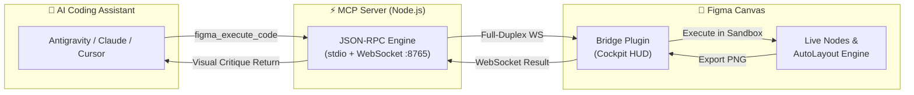

# ⚡ Figma MCP Bridge + Visual Feedback Loop

[](LICENSE)
[](https://modelcontextprotocol.io/)
[](https://nodejs.org)
[](https://python.org)
[](https://figma.com)

> A bidirectional real-time bridge connecting AI coding assistants (**Google Antigravity**, **Claude Desktop**, **Cursor**, **Windsurf**) directly to a live **Figma canvas**, powered by a **Multimodal Visual Feedback Loop** for autonomous UI generation, design system maintenance, and layout iteration.

---

## 🌟 Key Features



- **⚡ Full-Duplex Native WebSocket:** Zero-dependency RFC 6455 socket engine on port `:8765`. Instant Server-Push (< 1 ms latency), auto-reconnect, and immune to Electron background tab throttling.
- **🎨 Live Canvas Scripting:** Direct JavaScript execution inside the Figma desktop sandbox. Create and manipulate frames, AutoLayout hierarchies, vectors, component sets, and Figma Variables.
- **📸 Multimodal Visual Feedback Loop:** AI models execute code with `capture: true` to receive high-res PNG viewport captures directly back into their context window for visual self-critique.
- **💎 Figma Variables Native:** 100% token binding support (`setBoundVariableForPaint`, `setBoundVariable`) for dark/light themes, typography, radii, and spacing scales.
- **⚡ Zero External Dependencies:** Built with pure Node.js stdio JSON-RPC 2.0 and native browser APIs. Works on Windows, macOS, and Linux out of the box without `npm install`.
- **🛠 Comprehensive Tool Suite:** Dual-mode architecture supporting both local live canvas scripting and Figma Cloud REST API queries.
- **📦 Persistent Sandbox Runtime (`bridge`):** Reusable code modules and durable key/value storage that survive across calls and Figma restarts, plus wrappers for the Figma Plugin API's sharpest edges and error messages that tell the agent what to do instead.

---

## 📦 The `bridge` Runtime (inside `figma_execute_code`)

Every call to `figma_execute_code` is compiled as a **fresh async function body**, so top-level declarations vanish when the call ends — and `eval` cannot be used to work around it, because `eval` is a *bound* function inside the Figma sandbox and therefore always an **indirect eval**: declarations made inside it reach neither the caller nor `globalThis`, silently. The `bridge` object, injected into every call, is the supported way to carry things across calls:

```js
// call 1 — compile, validate and save into the .fig document
bridge.define("kit", `
  async function label(parent, text) {
    await ensureFont("Inter", "Medium");
    const t = figma.createText();
    t.fontName = { family: "Inter", style: "Medium" };
    t.characters = text;
    parent.appendChild(t);
    return t;
  }
  module.exports = { label };
`);

// call 2 (or next week, after a Figma restart)
const { label } = bridge.require("kit");
```

| API | What it is |
|-----|------------|
| `bridge.define(name, src)` / `require` / `list` / `source` / `remove` | reusable code modules, stored in the document, chunked past 60 KB |
| `bridge.store.set/get/remove/keys` | durable JSON key/value inside the `.fig` file |
| `bridge.state` | scratch object, survives calls, cleared on plugin reload |
| `bridge.componentize(node)` | `createComponentFromNode` without losing AutoLayout sizing modes |
| `bridge.setPosition(node, x, y)` | refuses `x`/`y` inside an `INSTANCE` early, naming the layout-based remedy |
| `bridge.info()` | the live runtime contract: execution model, injected globals, modules, stored keys |

Failed executions come back with a `HINT:` line whenever the bridge recognises the failure mode (unloaded font, instance override, stale node id after conversion, resizing a hugging AutoLayout frame, `pluginData` size limits, or a helper that no longer exists because the scope was fresh). Full details in [`figma/instructions.md`](figma/instructions.md) §0 and [`AGENTS.md`](AGENTS.md).

---

## 🚀 Quickstart (1 Minute)

### 1. Clone & Install

```bash
git clone https://github.com/kolganovr/figma-mcp-bridge.git
cd figma-mcp-bridge
python install.py
```

*Optional: Configure your Figma Personal Access Token during install:*
```bash
python install.py --token "your_figma_personal_access_token"
```

### 2. Import Plugin into Figma Desktop
1. Open **Figma Desktop**.
2. Navigate to **Menu (F)** ➔ **Plugins** ➔ **Development** ➔ **Import plugin from manifest...**.
3. Select `manifest.json` from `figma-plugin/manifest.json` (or `~/.gemini/antigravity/mcp/figma-plugin/manifest.json`).
4. Press **`Ctrl + Alt + P`** (macOS: `Cmd + Option + P`) to launch **Antigravity Bridge**.

### 3. Restart Your AI IDE
Restart your IDE (**Antigravity**, **Claude Desktop**, or **Cursor**) to discover the new MCP tools.

---

## 🛠 Available MCP Tools

### 1. Live Canvas Tools (Local Real-Time Engine)

| Tool | Parameters | Description |
| :--- | :--- | :--- |
| `figma_get_canvas_layout` | `direction` *(enum: RIGHT, BOTTOM)*<br>`gap` *(number, default 80)* | Inspects top-level artboard bounding boxes on active page and returns a calculated safe `suggestedNextPosition` to prevent overlaps. |
| `figma_insert_svg` | `svg_code` *(string, required)*<br>`name` *(string)*<br>`width`, `height` *(number)*<br>`fill_override`, `stroke_override` *(string)*<br>`color_override` *(string)*<br>`as_component` *(bool)*<br>`capture` *(bool)* | Inserts raw SVG/vector code into canvas or AutoLayout parent with proportional scaling, fill/stroke color overrides, optional master component wrapping, and PNG capture. |
| `figma_find_components` | `query` *(string)*<br>`page_name` *(string)*<br>`include_variants` *(bool)*<br>`limit` *(number)* | Fast token-efficient catalog search for master components, variant matrices, and component properties in the active document. |
| `figma_insert_component_instance` | `component_name` *(string)*<br>`component_id` *(string)*<br>`properties` *(object)*<br>`text_overrides` *(object)*<br>`target_parent_id` *(string)*<br>`capture` *(bool)* | Instantiates a master component or variant, safely overrides text/fonts, places into AutoLayout parent, and returns a PNG screenshot. |
| `figma_get_variables` | `collection_name` *(string)* | Retrieves all design tokens, Figma Variable collections, modes (e.g. Light/Dark), and values. |
| `figma_set_variables_mode` | `collection_name` *(string)*<br>`mode_name` *(string)*<br>`target_id` *(string)*<br>`capture` *(bool)* | Switches the active theme mode (e.g. "Dark", "Light") for a target frame, selection, or entire page. |
| `figma_execute_code` | `code` *(string, required)*<br>`description` *(string)*<br>`capture` *(bool, default false)*<br>`scale` *(number, default 1.5)* | Executes live JavaScript in Figma sandbox with `getFreePosition` helper. When `capture: true`, returns an uncompressed Base64 PNG screenshot directly to the model. |
| `figma_screenshot` | `node_ids` *(array)*<br>`scale` *(number)*<br>`description` *(string)* | Captures selected nodes or entire viewport as PNG. |
| `figma_get_selection` | *None* | Retrieves geometry, bounding box, fill/stroke properties, and hierarchy of currently selected nodes. |
| `figma_create_ui_card` | `title`, `subtitle`, `badge_text`, `button_text`, `bg_color`, `width` | High-level macro generator for AutoLayout cards with instant visual inspection. |

### 2. Cloud REST API Tools (with Token Optimizer)

| Tool | Parameters | Description |
| :--- | :--- | :--- |
| `get_file` | `file_key` *(string, required)*<br>`format` *(enum: jsx, tree, json, raw)*<br>`depth` *(number)*<br>`simplify` *(bool, default true)* | Retrieves file metadata and token-optimized layer hierarchy. Prunes 85%+ AST noise and returns clean Pseudo-JSX. |
| `get_node` | `file_key` *(string, required)*<br>`node_ids` *(string, required)*<br>`format` *(enum: jsx, tree, json, raw)*<br>`depth` *(number)*<br>`simplify` *(bool, default true)* | Fetches specific node subtrees converted to token-efficient Pseudo-JSX, Tree, or JSON format. |
| `get_image` | `file_key`, `node_ids`, `format`, `scale` | Renders remote images or frames via Figma Cloud. |
| `get_styles` | `file_key` | Inspects global published styles and color tokens. |
| `get_components` | `file_key` | Discovers published team components and variants. |
| `get_comments` / `post_comment` | `file_key`, `message`, `client_meta` | Reads and posts comments directly on design files. |

---

## 🔄 Updating the Bridge

To pull the latest updates and refresh your installed plugin and server:

```bash
git pull origin main
python install.py --update
```

---

## 🩺 System Diagnostics

To check your environment, Node.js runtime, port availability, and MCP config paths:

```bash
python install.py --doctor
```

---

## 📁 Repository Structure

```
figma-mcp-bridge/
├── figma/                      # MCP Server (Node.js stdio engine)
│   ├── index.js                # Server core + HTTP bridge (:8765)
│   ├── instructions.md         # AI Agent guidelines & design rules
│   ├── figma_execute_code.json # Live JS execution schema
│   ├── figma_screenshot.json   # Viewport screenshot schema
│   └── ... (Cloud REST schemas)
├── figma-plugin/               # Figma Desktop Extension
│   ├── manifest.json           # Figma plugin manifest
│   ├── code.js                 # Sandbox executor + bridge runtime + Base64 PNG encoder
│   └── ui.html                 # Dark HUD Cockpit UI + live event stream
├── tests/
│   └── bridge-runtime.test.js  # Contract test for the sandbox runtime (node, no deps)
├── install.py                  # Cross-platform installer, updater & doctor
├── LICENSE                     # MIT License
├── AGENTS.md                   # AI Agent onboarding instructions
└── README.md                   # Documentation & guide
```

---

## 📄 License

This project is licensed under the [MIT License](LICENSE).  
Developed by **Roman Kolganov** (2026).
